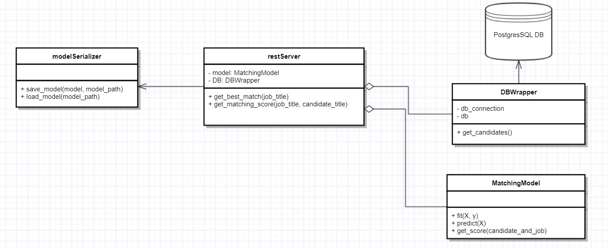

# HiredScore Task
* [Diagram](#diagram)
* [DB](#db)
* [Train Model](#train-model)
* [Rest Server](#rest-server)

## Diagram


## DB
### Information
* Database: PostgresSQL
* version: 12.2
* OS: tested on windows
* setup after installation (using psql):
    ```
    CREATE DATABASE hiredscore;
    \c hiredscore;
    CREATE TABLE candidates (title varchar(50) NOT NULL);
    INSERT INTO candidates (title)
        VALUES ('software developer'), ('devops'), ('db admin'), ('data scientist'), ('product manager');
    ```

## Train Model
```
python train.py [optional: <path to save the newly created model> | default path: "model.pkl"]
```

## Rest Server
### Run Server
```
. venv/bin/activate
export FLASK_APP=restServer
flask run
```

### End-Points
* __Best Match__:
    * Description: A rest endpoint that given a job title, returns the best matching candidate from DB (using the model).
    * End-Point: http://localhost:5000/bestmatch/<job_title>
    * Return Format: text
* __Get Score__:
    * Description:  A rest endpoint that given a job title and a candidate title, returns the "matching score" (using the model).
    * End-Point: http://localhost:5000/score/job=<job_title>&candidate=<candidate_title>
    * Return Format: text
    * Available Scores: 0 or 1